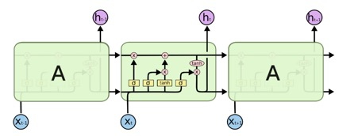
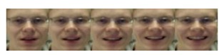
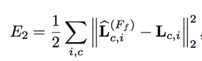
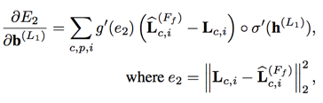

# CNN-LSTM spatio-temporal Features with Partial Expression Sequences and on-the-Fly Prediction

## CNN

   Convolution Neural Networks is said to be the best methodology to learn
   vast quantity of data(images) with minimal pre-processing and classify
   them into different categories that too with great accuracy and in real
   time.

   The whole model is divided into sections:

   1.  Feature extraction

   2.  Classification

   Feature extraction is implemented by arranging series of layers which
   subsamples the images and perform operations such as convolutional,
   batch normalization, ReLU activation, pooling, dropout, etc. And finally
   all the channels are flattened into array of feature vectors. These are
   done with equations of weights and bias matrices (cost function).

   Classification Section, further dense the fully connected layer into
   classified categories.

   **Formulating the classification section (manipulating weights and bias)
    according to required needs, increases the classification accuracy.**

## LSTM

   

   
   

   -   Long Short Term Memory(LSTM) networks are capable of learning
        long-term dependencies. Each block in the sequence is called cell
        state.

   -   Each cell state stores the processed data of previous states. Which
        helps in predicting present scenario.

   -   In each cell, using previous information they perform operation such
        as select, forget, store, combine, etc over present data. This
        enhances the feature vector of present data. Hence, gives dynamic
        approach.

   -   LSTM is implemented in scenarios where the dataset is sequence of
        images(video), sequence of words(sentences), to predict the upcoming
        image or word. 

### Applications:

Weather forecasting, word prediction, video frame prediction, language
modelling, image captioning, question answering, video to text, etc.

## Overview:

CNN-LSTM spatio-temporal Features with Partial Expression Sequences and
on-the-Fly Prediction can be implemented for emotion recognition over camera
captured facial images. This algorithm is proposed for dynamic
classification of expression in real time based on previous rescent
expressions on the face.

The video captured by the camera is **sequence of frames(images)**,
having human faces showing emotions. Humans poses emotion expressions on
their face for atleast a desirable period of time (say atleast 50
frames), thus forming a sequence of frames (increasing happiness,
decreasing happiness, inc anger, dec anger). Expressions don’t change
drastically per frame.

So, based on previous frames knowledge we can more accurately classify
present frame’s emotion.

We know, CNN features extraction is performed by adjusting weights and
bias (cost function) between layers. So features vectors are derived for
each frame. These feature vectors are used for further classification.

Formulating the weights and bias further based on previous frames
classification (previous weights and biases), we can easily and
accurately classify present frames expression.

## Comparison:

Overcomes anomalies of other models.(CNN, 3d-CNN, Inception-CNN, simple
CNN-LSTM, Deep-CNN, etc)

Fast, simple, accurate, dynamic and very flexible. As features and classifactions both are enhanced

## CNN-LSTM spatio temporal feature model

### Methodology:

***Facial emotion recognition:***

1.  Camera captures frames of images.

2.  Haar Cascade xmls are used for detecting faces and cropping.
    (haarcascade\_frontalface\_default.xml)

3.  Multi- Face tracking or single-face (most near) detection.

4.  Pre – processing the images:

   -   Reshaping into (64,64,3)

   -   Data augmentation (angle, pixel value, etc) \[optional\]

   -   Using keras pre-processor ImageDataGenerator

         (featurewise\_center, featurewise\_std\_normalization, flip, rotate)

5.  Create dynamic sequence of frames (eg.: set max. limit = 100 frames)

6.  Sequence of frames feed into our CNN-LSTM core model (refer below)

7.  Predicted emotion label is output

**Libraries:** keras, numpy, python, opencv, panda (versions and additional
lib is to be updated).

### Dataset:

MMI, Oulu-CASIA, youtube, etc \[not yet arranged\]

## Core Model Flowchart

Nf: number of frames

Frame shape: 64x64x3

LSTM(6): 6 is number of classes(Happy, Sad, Angry, Disgust, Fear, Surprise)

## Architecture of code for above methodology:

[Experiments/lstmcnn copy-Copy1.ipynb](https://github.com/shreyashk09/CNN-LSTM-RNN-with-spatio-temporal-feature-representation/blob/master/Experiments/lstmcnn%20copy-Copy1.ipynb)

CNN Model:
[link](https://github.com/shreyashk09/Emotion-Recognition---Neural-Networks)

The code, displays model.summary() of important models
(cnnmodel, LSTM). Connection between these models and structure of
implementation objectives E1 and E2 are also shown.

## Core Model Explanation

-   The training set consists of “sequences of frames” (video clips).

-   The input to model consists of only a sequence of frames at a time

-   Each “sequence of frames” represents only one expression and
    assigned single label for whole sequence.(reduce efforts for
    labelling each frame)

-   The intensity of expression increases across the sequence (neutral
    to highly expressive)
    

-   Thus, the input is \[Nf,64,64,3\], where Nf is number of frames

-   All frames are simultaneously processed by
    CNN((64,64,3)-&gt;(512,1)) using TimeDistributed function

-   The cumulative output \[Nf,512\] is our **spatial intensity vector**
    of each frame.

    Based on these intensity vectors we can improve the classification,
    by fulfilling 2 objectives:

**E1**: minimizing expression sequence classification error

**E2**: minimizing the expression intensity prediction error

We know, relation between layers and classification is done by weight
matrix. So, we try updating weight matrix efficiently (cost function).

## Achieving E1:

-   The intensity vectors are TimeDistributed Densed into \[Nf,6\].(each
    frame is densed into 6 parallely)

-   LSTM is added to map \[Nf,6\] to \[6\] for each frame, based on
    previous frames prediction. This done by applying
    “categorical\_crossentropy” loss function (also defines gradient
    descent in cost function).

The gradient of this function(based on entropy of each class (\[6\]))
updates weights of LSTM layer.

Thus, classifies into 6 classes.

The optimization by E1 highly affects the spatio-temporal feature at the
last frame of sequence

## Achieving E2:

Due to E1 miss-classification could occur when prediction is performed
at early frames of the sequence.

The prediction of the correct expression could be delayed until the end
frames of the sequence. To mitigate the aforementioned delay problem, we
propose the second objective term (E2), which minimizes expression
intensity prediction error.

So, in a separate function,

-   Taking spatial feature vectors(\[512,1\]) from cnnmodel, we perform
    cossimilarity over them where the last frame is always taken as apex
    frame.

-   Further min\_max\_normalisation is applied over them and Euclidean
    loss function is implemented.

-   Weights are taken form E1 final layer (last LSTM layer) and are
    updated and set back into the layer.

-   Weights here are updated by gradient of Euclidean loss function in a
    separate model

(dot product of gradient and LSTM value)

Thus weights are updated multiple times for better classification of
sequence after each epoch.

The working model input consists of only a sequence of frames at a time
(sequence is updated as soon as new frame is captured by camera)

## Steps towards accuracy:

- CNN model used above gives approx 68% accuracy with kaggle FER dataset;
- Code will be tested with different CNN models(  VGG_face(causes overfitting), 
         high-low subsampling, low-high sub sampling, multiple-CNN fusion) until satisfactory accuracy is not met.
- Code will be tested to check wheather creates lag in detection of change in expression(though E1 adn E2 takes care of them) 
           by varying LSTM efficiency.(also go for convLSTM ) until results aren't tuned with real time.
- The base concept of model is similar to winning model of Youtube-8M contest.
           Link: <https://blog.coast.ai/five-video-classification-methods-implemented-in-keras-and-tensorflow-99cad29cc0b5>

- Preprocessing will be preffered to be at low level but efficient.(creates frames lag)

**
  Thank You 
**

**Similar codes(CNN-LSTM Video Classifier):**

- <https://github.com/keras-team/keras/blob/master/examples/imdb_cnn_lstm.py>

- <https://github.com/topics/video-classification>

**Related research papers:**

- Learning Spatio-temporal Features with Partial Expression Sequences for
on-the-Fly Prediction \[ <https://arxiv.org/pdf/1711.10914.pdf> \]

- Differential Generative Adversarial Networks: Synthesizing Non-linear
Facial Variations with Limited Number of Training Data \[
<https://arxiv.org/pdf/1711.10267v4.pdf> \]

- Dynamics Transfer GAN: Generating Video by Transferring Arbitrary
Temporal Dynamics from a Source Video to a Single Target Image \[
<https://arxiv.org/pdf/1712.03534v1.pdf> \]

- Modeling Spatial-Temporal Clues in a Hybrid Deep Learning Framework for
Video Classification \[ <https://arxiv.org/pdf/1504.01561.pdf> \]

- Two-Stream Convolutional Networks for Action Recognition in Videos \[
<https://arxiv.org/pdf/1406.2199v2.pdf> \]

- Modeling Spatial-Temporal Clues in a Hybrid Deep Learning Framework for
Video Classification \[ <https://arxiv.org/pdf/1504.01561v1.pdf> \]
