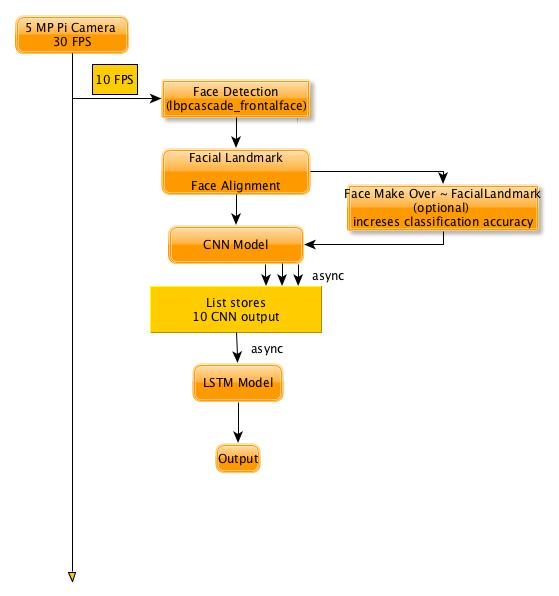

### AIM

Aim is to get 10 FPS output with whole computation in real time.

### RUN TIME MODEL

   
### CNN-LSTM spatio-temporal runtime model

### TRAINING MODEL
**MODEL 1:**

**MODEL 2:**
tarining simple-CNN

### OVERVIEW
To acquire the aim i.e, gain output for maximum number of fps, we can develop the run - time model such a way that, it require minimum of GPU and perform task asyncronously.
In the model, the camera generated vidoe will be our main stream, form which a certain number of frames will be taken per second one by one into a thread where DNN coputation will take place. This will not create a burden on DNN model and ouput will be in real-time.

The acquired each single frame is processed for face detection, using ***lapcascade cascader***(faster that Haarcascade).
Further, the detected face rectangle is aligned(using facial-landmarks, face_recognition of opencv). (Optionally, using fcial-landmarks we can make-over the face i.e, for each AU different colours can be used and their shades for change in their intensity). 

Steps, upto here are it's mandatory even if we go with other conventional methodology(apart from DNN).

There is a global list of arrays. These arrays are output vectors of simple CNN model. The arrays in global list are updated accroding to effeciency of CNN model, irrespective of LSTM model. Thus, burdern to compute result of all frames till end is reduced. 

The LSTM model is asyncronously takes the global list of updated arrays to process. The output is derived from the LSTM model based on it's own efficiency. Thus, burdern of LSTM model(heavy) is removed away from simple CNN model.

The CNN mdel may update more than array in the global list. And LSTM model will take the global list at it is available at the moment.

Thus, output is obtained asyncronously in real time.

### HARDWARE REQUIRMENTS

### TECHNOLOGY TO IMPROVE FPS

- NEON (included in with Open CV cmake)
- VFPV3 (included in with Open CV cmake)

### EVIDENCE
On implementing following DNN algorithms on Raspberry Pi 3:

***GoogleNet:***

***SqeezeNet:***

**Without above improvements:**
GoogleNet = 1.7 seconds per frame = 0.58 fps
SqeezeNet = 0.9 seconds per frame = 1.11 fps

**With above improvements:**
GoogleNet = 0.87  seconds per frame = 1.14 fps
SqeezeNet = 0.47  seconds per frame = 2.12 fps

**Please Refer**
https://www.pyimagesearch.com/2017/10/09/optimizing-opencv-on-the-raspberry-pi/
